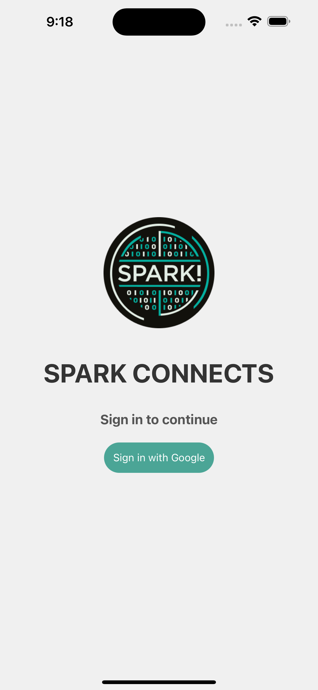

# Spark! Connects

## Inspiration 💡
The inspiration for Spark! Connects came from recognizing a gap in social connectivity and representation among students in the computing fields at Boston University. We observed that while there's immense talent and diverse interests within BU Spark!, the largest computing organization at the university, students often struggled to find and connect with peers who share similar academic and professional interests. Our goal was to bridge this gap, creating a platform that not only fosters connections but also amplifies the presence and collaboration of students in this vibrant community.

## What it does 🤨
Spark! Connects is a cutting-edge social media application tailored for university students specializing in computing disciplines. It revolutionizes the way students engage with each other by leveraging Language Learning Models (LLMs) to match users with similar interests, thus facilitating meaningful connections. The app automatically generates user profiles based on these interests, streamlining the process of finding and networking with like-minded individuals. It also features a unique Google Maps integration, enabling users to discover and connect with nearby peers in an intuitive, Apple AirDrop-like interface. Additionally, a calendar and feed feature keeps users updated on Spark! events and activities, further enhancing community engagement.

## How we built it 🛠
* Backend:
  - Used Firebase to store user login information.
  - Utilized OpenAI API and prompt engineering LLMs for automatic user profile generation from intake form.
  - Created REST API using FastAPI.

* Frontend:
  - Designed a user-friendly interface with React Native and Expo for cross-platform compatibility.
  - Implemented user authentication and intake form logic and UI.

* UI/UX:
  - Figma was heavily used in the design process of the application.

## Challenges we ran into 🥶
One of the major challenges was configuring authentication of users with Firebase since it required a native code workaround. Since our team had limited experience with React Native we were also learning the syntax as we went, which proved to be difficult.

## Accomplishments that we're proud of 🏆
We are immensely proud of starting a ongoing project and platform that hopes to facilitate connections within the BU computing community.

## What we learned 📚
Throughout this project, we've gained invaluable insights into the intricacies of developing a social media platform, especially in the areas of user experience design, data privacy, and real-time data processing. We also learned the importance of interdisciplinary collaboration, combining insights from computing, social sciences, and design to create a holistic and impactful application.

## What's next for Spark! Connects 🔮
Looking ahead, we plan to expand Spark! Connects by introducing more personalized features, such as AI-driven event recommendations and enhanced profile customization options. We also aim to implement more robust data security measures and explore partnerships with other university departments and organizations to broaden our reach and impact. Our vision is to make Spark! Connects a cornerstone of student interaction and collaboration within the computing community at Boston University and beyond.